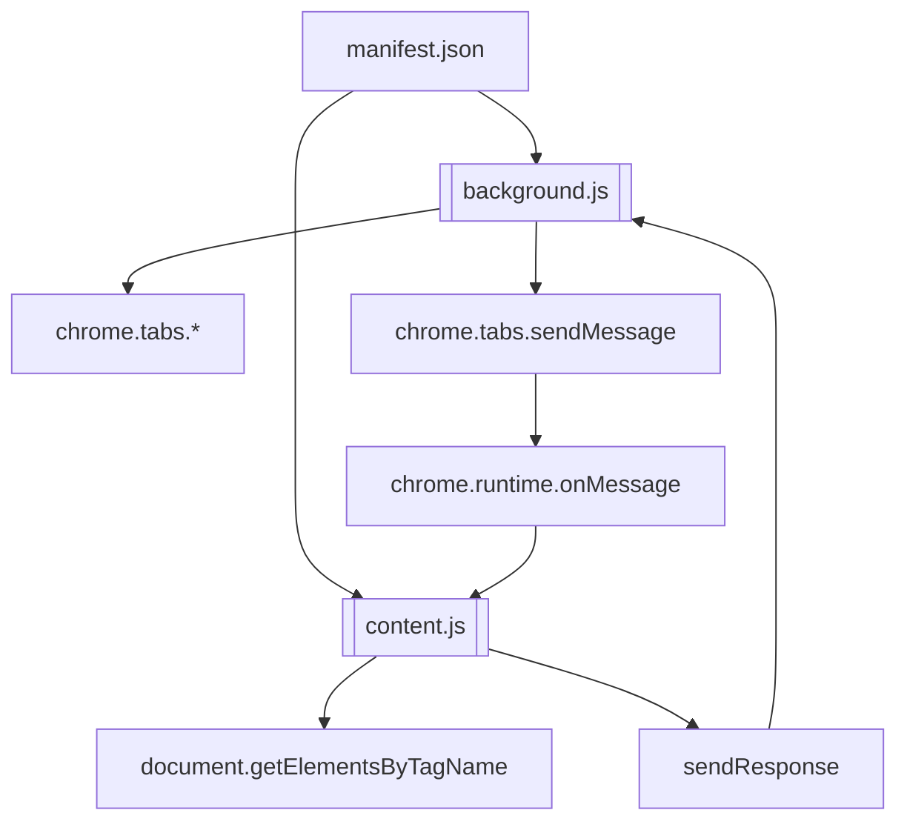

# chrome_extension
close yurled, open image, hello world

```mermaid
flowchart TD
    manifest.json --> background.js[[background.js]] --> chrome.tabs.*
    manifest.json --> content.js --> document.getElementsByTagName
    background.js --> chrome.tabs.sendMessage
    
    chrome.tabs.sendMessage --> chrome.runtime.onMessage
    
    chrome.runtime.onMessage --> content.js
    content.js[[content.js]] --> sendResponse
    sendResponse --> background.js
```
